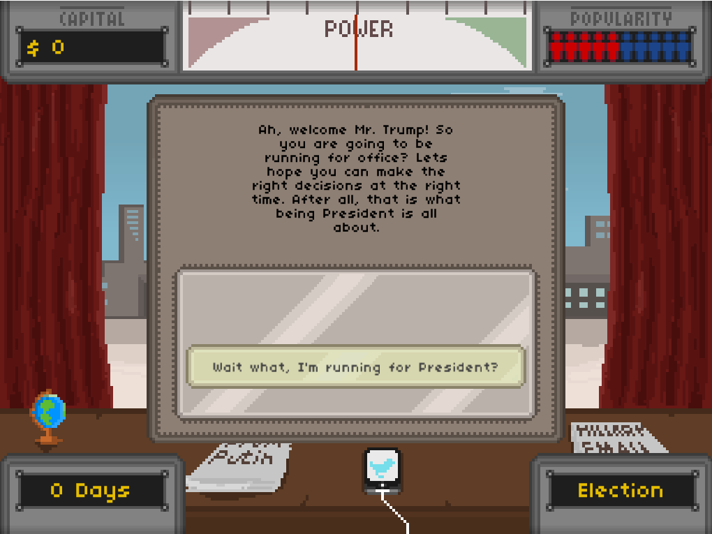

# Trump Card

Do you look at our current president and think "That's easy, even I can do that!". Do you think you can make better decisions than Donald Trump? Welcome to Trump Card, where you are Mr. President.

_**Note:** the journey might contain shocking imagery. All choices in the game solely exist for comedic reasons and not with the intention to hurt anybody._

# Run the game

## Windows

Go to the [releases page](https://github.com/Sidesplitter/Ludum-Dare-39/releases) and click the latest release. Download the Windows-binary and you're good to go!

## Linux

Go to the [releases page](https://github.com/Sidesplitter/Ludum-Dare-39/releases) and click the latest release. Grab the latest Linux-version. After extracting this ZIP-file, make sure that you execute `chmod +x runner` in the extracted directory. After that you can run the game by executing `./runner` in the terminal.

# How to Play

Each turn you get one to three dialogue options you can choose from. Each choice influences your money, power and popularity. Your task is to balance these three meters throughout the game. 

# Footnote

This game was made for [Ludum Dare 39](https://ldjam.com/events/ludum-dare/39), if you liked our game, feel free to rate Trump Card at [Ludum Dare](https://ldjam.com/events/ludum-dare/39/trump-card).